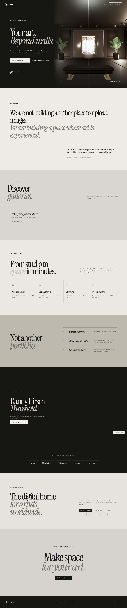
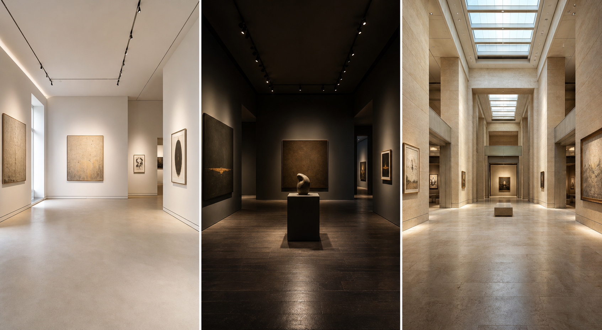
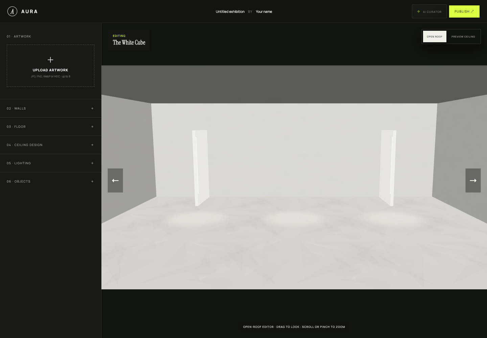
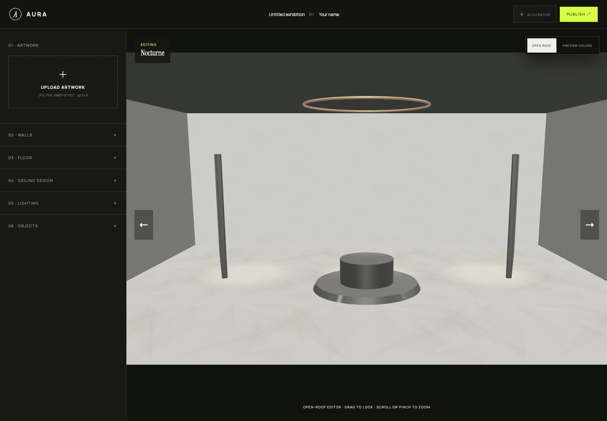
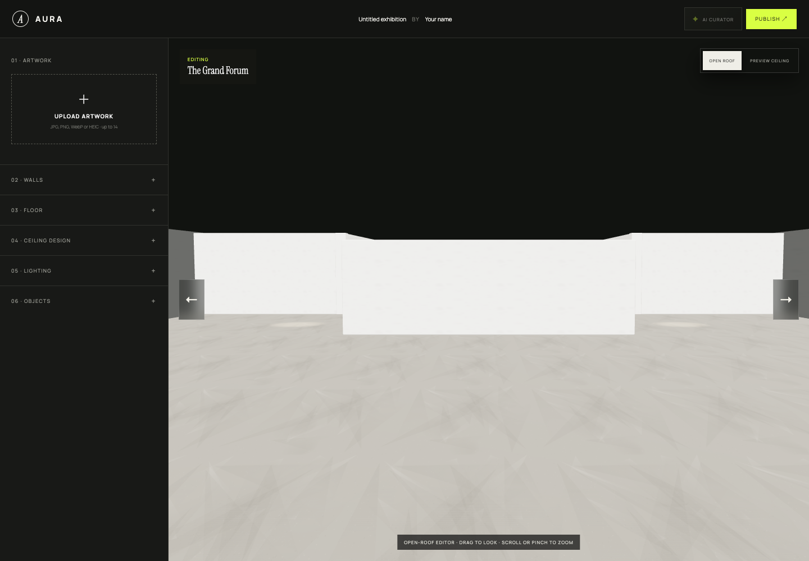
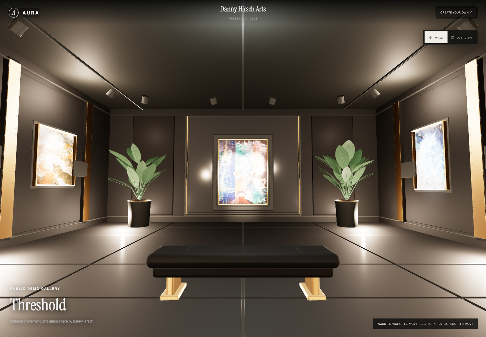
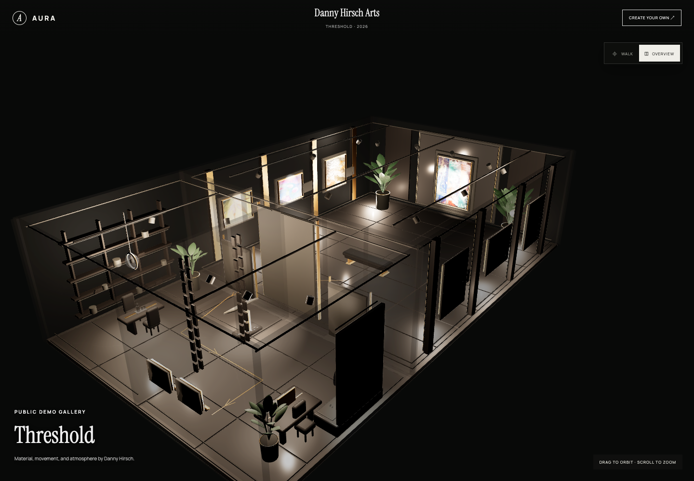
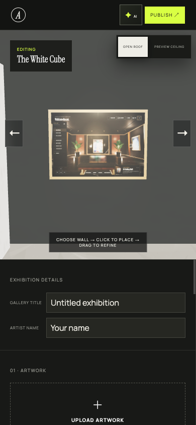

# AURA – UI/UX-, 3D- und Pitch-Readiness-Audit

> **Hinweis:** Dieses Dokument ist der Vorher-Snapshot. Der umgesetzte und neu gemessene Stand steht in [`IMPLEMENTATION-STATUS.md`](./IMPLEMENTATION-STATUS.md).

## P0-Konsistenz-Update · 11. August 2026

- Danny, veröffentlichte prozedurale Räume und Builder Walk Preview verwenden jetzt dieselbe `VisitorControls`-Komponente und dieselbe Reihenfolge: Modus, Guided Tour, Smart View, Reset View, Artworks.
- Intro und Guided Tour sind getrennte Abläufe. Danny behält authored Routen; Builder-Räume erzeugen reproduzierbare Stops aus Kunstwerkpositionen und Wandnormalen.
- Beide Tour-Systeme unterstützen Skip, Pause/Resume, Vor/Zurück, Stopname und Fortschritt. Eigene Bewegung pausiert die Tour; Reduced Motion springt ohne Kamerafahrt zu einem sinnvollen Ziel.
- Die gemeinsame Walk-Steuerung lautet: W/S vor/zurück, A/D seitlich, Q/R oder Pfeil hoch/runter schauen, Pfeil links/rechts drehen, Drag-look, Click/Tap-to-walk, Scroll/Pinch-Zoom und Escape zurück zu Overview beziehungsweise Arrange.
- Auf Touch-Geräten wird kein WASD-Hinweis mehr angezeigt. Walk Preview klappt das Mobile-Bottom-Sheet auf Peek ein, zeigt die Controls als Safe-Area-Bottom-Bar und stellt beim Rückweg zu Arrange den vorherigen Sheet-Zustand wieder her.
- Lokale Entwürfe sind jetzt echte Projekte mit eigener ID. Mehrere Räume desselben Templates können gespeichert und im Picker einzeln fortgesetzt werden. IndexedDB-v1- und localStorage-v1-Entwürfe werden als Legacy-Projekte migriert.
- Publishing besitzt eine getestete State Machine für Vorbereitung, Write, Erfolg, Fehler und Retry. Nach erfolgreichem Publish bleibt die stabile Success-Seite sichtbar; fehlgeschlagene Writes löschen den lokalen Entwurf nicht.
- Neue White-Cube-Projekte starten mit hellem mineralischem Concrete; Grand Forum mit Skylight. Belichtung und Cutaway-Hintergründe wurden pro Template ruhiger kalibriert.

Automatische Abnahme: Lint, 75 Tests und TypeScript-Build grün. Die verpflichtende neue Sichtprüfung bei 1440 × 1000 und 390 × 844 bleibt offen, weil in dieser Sitzung kein verbundener Browser verfügbar war. Keine Live-Daten, Firebase-Regeln oder Deployments wurden verändert.

Stand: 2. August 2026  
Scope: Landingpage, Template-Auswahl, Raumgestalter, alle drei Runtime-Räume, Danny-Hirsch-Demo, Walk/Overview, Mobile, Accessibility, Performance, Publishing und B2B-Tauglichkeit.

## Kurzurteil

AURA hat eine starke Marke und einen echten funktionierenden 3D-MVP. Die Landingpage verkauft jedoch aktuell eine deutlich hochwertigere Welt als der Raumgestalter tatsächlich erzeugt. Für einen privaten Alpha-Test ist das überzeugend. Für Firmen-, Galerie- oder Museumspitches ist die Lücke zwischen Versprechen und Produkt noch zu groß.

**Pitch-Readiness: 44 / 100**

Der schnellste Weg zu einem überzeugenden MVP ist nicht mehr Homepage-Text. Er ist:

1. 3D-Grundsystem stabilisieren.
2. White Cube, Nocturne und Grand Forum auf Demo-Qualität bringen.
3. Platzierung, Autosave, Undo und Walk-Preview verlässlich machen.
4. Den echten Produktablauf als eine starke Scroll-Story auf der Homepage zeigen.
5. Einen privaten Pilot-Link, dauerhafte Galerien und klare Proof-Signale ergänzen.

## Scorecard

| Bereich | Score | Urteil |
|---|---:|---|
| Marke, Typografie, Art Direction | 8/10 | Eigenständig, hochwertig, editorial |
| Value Proposition | 7/10 | Schnell verständlich, aber nur für Artists formuliert |
| Produktbeweis auf der Homepage | 4/10 | Gute Demo-Bilder, echter Ablauf bleibt verborgen |
| Gewünschtes 3D-Scrollytelling | 1/10 | Noch nicht vorhanden |
| Template-Auswahl | 4/10 | Schön gesetzt, aber generische CSS-Miniaturen |
| Qualität der drei Builder-Räume | 3/10 | Funktional, visuell klar unter dem Hero-Versprechen |
| Raumgestalter / Placement UX | 4/10 | Viele Funktionen, aber hohe Fehlertoleranz und wenig Sicherheit |
| Walk- und Overview-Erlebnis | 5/10 | Gute Basis, wichtige Kollisionen und Kameraentscheidungen fehlen |
| Danny-Hirsch-Demo | 6/10 | Stärkstes Produktstück, nutzt sein GLB aber nur teilweise |
| Mobile | 5/10 | Eigene Layoutlogik vorhanden, Bedienfläche und Lesbarkeit knapp |
| Accessibility | 5/10 | Gute Basis, Canvas und Kontraste bleiben kritisch |
| Performance | 3/10 | Landing akzeptabel, 3D-Demo im Mobile-Labtest langsam |
| Publishing / Trust / B2B | 2/10 | Kein Pilot-, Privacy-, Versions- oder permanentes Angebotsmodell |

## Methode und belastbare Evidenz

- Aktueller Production-Build mit npm run check geprüft: Lint und Build grün.
- Lokaler Production-Preview und Development-Build visuell getestet.
- Desktop: 1440 × 1000.
- Mobile: 390 × 844.
- White Cube, Nocturne, Grand Forum, Editor mit Test-Artwork, Danny Walk und Danny Overview geprüft.
- Walk/Overview-Schalter praktisch verifiziert.
- Der öffentliche GitHub-Pages-Endpunkt liefert HTTP 200. Die dort referenzierten Bundle-Hashes entsprechen dem lokalen Build.
- Lighthouse im simulierten Mobile-Profil auf Landing und Demo ausgeführt.
- Keine Veröffentlichung, Löschung oder Änderung externer Firebase-Daten durchgeführt.
- Discover lieferte im lokalen Production-Preview Firebase permission-denied. Das beweist keinen Live-Fehler, muss aber vor jedem Pitch live end-to-end verifiziert werden.

Artefakte:

- [Landing Desktop](screenshots/home-cdp-full.png)
- [Landing Mobile](screenshots/home-cdp-mobile-full.png)
- [Editor leer](screenshots/editor-empty-desktop.png)
- [Editor mit Artwork](screenshots/editor-artwork-desktop.png)
- [Editor Mobile](screenshots/editor-mobile.png)
- [White Cube](screenshots/room-white-cube-default.png)
- [Nocturne](screenshots/room-nocturne-default.png)
- [Grand Forum](screenshots/room-pavilion-default.png)
- [Danny Walk](screenshots/demo-walk-desktop.png)
- [Danny Overview](screenshots/demo-overview-verified.png)
- [Lighthouse Landing JSON](lighthouse-home.json)
- [Lighthouse Demo JSON](lighthouse-demo.json)
- [Browser-Messbericht](browser-report.json)

## Was bereits gut ist

- Die Kernidee ist in wenigen Sekunden verständlich: Kunst wird nicht nur hochgeladen, sondern räumlich erlebt.
- Headline, Instrument-Serif-Typografie, Manrope-Kontrast und dunkle/helle Flächen bilden eine erkennbare Marke.
- Zwei klare Einstiege stehen sofort bereit: Erstellen und Live-Demo ([App.tsx:78](../src/App.tsx#L78)).
- Der MVP ist real: Upload, automatische Platzierung, direkte Manipulation, Materialien, Licht, Objekte, AI Curator, Veröffentlichung und Share-Link existieren.
- Walk und Overview sind sichtbar getrennt und haben kontextspezifische Hinweise ([App.tsx:279](../src/App.tsx#L279)).
- Skip-Link, Fokus-Styling, Fehlerzustände, Reduced-Motion-Grundlage und Artwork-Dialog sind eine gute Accessibility-Basis ([App.tsx:283](../src/App.tsx#L283), [App.tsx:335](../src/App.tsx#L335), [global.css:64](../src/styles/global.css#L64)).
- Der AI Curator erklärt transparent, dass Bilder im Browser bleiben. Das ist ein gutes Trust-Muster.
- Die Danny-Demo beweist, dass AURA eine deutlich reichere Raumwelt darstellen kann als die drei Builder-Templates.

## P0 – Blocker vor externen Pitches

| Blocker | Evidenz | Wirkung | Fix |
|---|---|---|---|
| Qualitätsbruch zwischen Hero/Danny und Builder | [Hero](screenshots/home-cdp-desktop.png) gegen [White Cube](screenshots/room-white-cube-default.png) | Nutzer erwarten Premium und erhalten einen flachen Prototypraum | Drei Builder-Räume auf eine gemeinsame visuelle Qualitätsbar bringen |
| Gewünschte Scroll-3D-Story fehlt | Hero ist ein statisches WebP ([App.tsx:39](../src/App.tsx#L39)); smooth bedeutet nur CSS scroll-behavior ([global.css:2](../src/styles/global.css#L2)) | Der wichtigste Produktbeweis wird nicht gezeigt | Eine einzige reversible, scrollgebundene Produktsequenz bauen |
| Runtime ist nicht Blender-basiert | README nennt prozedurale Runtime und veraltete Blend-Quellen ([README.md:133](../README.md#L133)); Marketing sagt Blender-based ([App.tsx:83](../src/App.tsx#L83)) | Vertrauensbruch im Pitch | Einen echten Blender→GLB→Runtime-Vertrag schaffen oder Claim ehrlich ändern |
| Keine verlässliche Kollision | White Cube/Nocturne ohne Raumkollision; Grand Forum nur partiell; Danny-Collider werden versteckt und ignoriert ([GalleryScene.tsx:372](../src/features/gallery/GalleryScene.tsx#L372), [GalleryScene.tsx:658](../src/features/gallery/GalleryScene.tsx#L658)) | Besucher laufen durch Wände, Möbel und Kunst | Capsule, Collider/Navmesh, swept collision und validiertes Click-to-walk |
| Entwürfe gehen verloren | Draft lebt nur im React-State; Hashwechsel setzt Template zurück ([App.tsx:166](../src/App.tsx#L166), [App.tsx:338](../src/App.tsx#L338)) | Refresh oder falscher Klick vernichtet Arbeit | Autosave, Recovery und Undo/Redo vor weiterer Politur |
| Platzierung kann ungültig werden | Slider umgehen freie Slots; Drag kann visuell bleiben, obwohl Parent-State ablehnt ([App.tsx:198](../src/App.tsx#L198), [GalleryScene.tsx:575](../src/features/gallery/GalleryScene.tsx#L575)) | Editor und veröffentlichter Zustand weichen ab | Eine gemeinsame transaktionale Placement-Engine mit accept/reject und Snapback |
| Renderer wird bei Interaktion neu aufgebaut | Effekt hängt an Draft und Selection; Renderer, PMREM, Geometrie, Texturen und Lichter werden neu erstellt ([GalleryScene.tsx:476](../src/features/gallery/GalleryScene.tsx#L476), [GalleryScene.tsx:634](../src/features/gallery/GalleryScene.tsx#L634)) | Flicker, GPU-Spitzen, schlechte Slider, Mobile-Crashrisiko | Szene persistent halten; nur betroffene Objekte/material properties ändern |
| Danny-Demo nutzt ihr GLB nicht aus | 27 Collider, 12 Animationen, 16 View-Anker, 8 Routen und reiche Extras existieren, werden aber weitgehend ignoriert ([GalleryScene.tsx:663](../src/features/gallery/GalleryScene.tsx#L663)) | Bestes Asset fühlt sich unfertig an | Metadatenvertrag, Interaction-Hitplanes, AnimationMixer, Collider und View-Anker aktivieren |
| Grand Forum ist inhaltlich nicht editierbar wie versprochen | Fünf Galerien versprochen ([templates.ts:11](../src/features/gallery/templates.ts#L11)); nur vier Außenwände plus zwei Divider-Seiten auswählbar ([App.tsx:142](../src/App.tsx#L142)) | Wichtigstes B2B-Template bricht sein Versprechen | Jede Raumzone und Innenwand adressierbar machen |
| B2B-Angebot und Trust fehlen | Footer hat nur Claim/Copyright; kein Pilot, Preis, FAQ, Datenschutz, Case Study oder Kontakt ([App.tsx:92](../src/App.tsx#L92)) | Firmen können nicht bewerten, kaufen oder Vertrauen aufbauen | Pilot-Angebot, Privacy, dauerhafte/private Links, Case Study und Kontakt ergänzen |

## Homepage-Audit

### Aktueller Eindruck

Die Seite wirkt wie ein gutes Art-/Fashion-Editorial. Das ist eine Stärke. Sie wiederholt aber denselben emotionalen Gedanken in Mission, Why AURA und Long-term Vision. Der konkrete Produktbeweis kommt zu spät und bleibt statisch.

Konkrete Probleme:

- Neun große Abschnitte und auf Mobile etwa 8.250 px Scrollhöhe.
- Hero, Mission, Difference und Horizon argumentieren mehrfach gegen statische Portfolios.
- Die Produktbedienung wird nur in vier Textkarten beschrieben.
- Die drei Templates erscheinen erst nach dem Klick auf Create und dort nur als generische CSS-Räume ([App.tsx:94](../src/App.tsx#L94), [global.css:6](../src/styles/global.css#L6)).
- Keine echte Vorher/Nachher-Transformation: leere Fläche → Raum → Kunst → veröffentlichte Galerie.
- Keine belastbare Case Study. Danny ist genannt, aber ohne Aussage zu Aufgabe, Prozess, Resultat oder Nutzen.
- Kein eigener Einstieg für Galerie, Museum, Agentur, Marke oder Unternehmen. Der Audience-Block adressiert nur unabhängige Künstler ([App.tsx:86](../src/App.tsx#L86)).
- „Digital home“ und standardmäßig zehn Tage öffentliche Laufzeit widersprechen sich ([App.tsx:63](../src/App.tsx#L63), [App.tsx:87](../src/App.tsx#L87)).
- Hash-URLs und statische Open-Graph-Daten geben jeder veröffentlichten Galerie dasselbe Social Preview ([index.html:8](../index.html#L8)).

### Empfohlene neue Reihenfolge

1. **Hero:** ein Satz, ein Primary CTA, ein Secondary CTA, echtes Raum-Endbild.
2. **Scroll-3D-Story:** Raum entsteht und zeigt den vollständigen Workflow.
3. **Sofortiger Sandbox-Moment:** „Mit Demo-Kunst ausprobieren“; keine Anmeldung.
4. **Echte Räume:** drei echte Live-Renders, Maße, Kapazität, idealer Use Case.
5. **Danny Case Study:** Ausgangslage, Aufbau, Besucheransicht, Resultat.
6. **Use Cases:** Artist, Gallery, Museum, Brand/Agency.
7. **Angebot:** kostenloser 10-Tage-Test; permanenter Artist-Plan; Institution/Brand-Pilot als Kontakt.
8. **Trust:** Öffentlichkeit, Rechte, Datenschutz, Performance, unterstützte Geräte.
9. **FAQ und finaler CTA.**

Mission, Difference und Horizon sollten zu einem kurzen Manifest verdichtet werden. Das spart Länge und schafft Platz für echtes Produkt.

## Scroll-3D-Konzept

„Emil-Kowalski-Stil“ ist kein bestimmter 3D-Look. Es ist Motion-Urteil: Bewegung muss einen Zweck haben, natürlich starten, schnell reagieren, reversibel sein und rechtzeitig aufhören. Relevante Quellen: [Good vs Great Animations](https://emilkowal.ski/ui/good-vs-great-animations), [You Don’t Need Animations](https://emilkowal.ski/ui/you-dont-need-animations), [Agents with Taste](https://emilkowal.ski/ui/agents-with-taste).

Es gibt inzwischen ein offizielles Skill-Repository mit emil-design-eng, review-animations, improve-animations und find-animation-opportunities: [emilkowalski/skills](https://github.com/emilkowalski/skills). Für diesen Audit wurde es recherchiert, aber nicht installiert.

### Empfohlene Sequenz

| Scroll | Szene | Botschaft |
|---:|---|---|
| 0–12 % | Ruhiger Blueprint / Bodenraster | Starte mit einem Raum |
| 12–30 % | Boden und Wände wachsen aus logischen Kanten | Kein 3D-Wissen nötig |
| 30–48 % | Wand-, Bodenmaterial und Licht verändern sich | Atmosphäre kuratieren |
| 48–68 % | Kunst gleitet auf reale Snap-Punkte | Werke sicher platzieren |
| 68–80 % | Ein kleines echtes Editor-Overlay zeigt Drag + Align | Präzise, aber einfach |
| 80–90 % | Kamera geht von Orbit auf 1,75 m Augenhöhe | Sehen wie ein Besucher |
| 90–100 % | Publish-Link und finaler Raum | Jetzt selbst ausprobieren |

Regeln:

- Nur eine große 3D-Sequenz auf der Homepage.
- Kein Scroll-Hijacking und keine automatische Raumrotation.
- Fortschritt direkt und rückwärts an Scroll koppeln.
- Bestehende Objekte: starkes ease-in-out.
- Einblendungen: ease-out.
- Kleine UI-Bewegungen unter 300 ms.
- Kamerawege kurz, klar und ohne große Spins.
- Der Endframe bleibt ruhig und wird zur echten Sandbox.
- DOM-Text bleibt über dem Canvas. Kein Text als 3D-Textur.
- Reduced Motion zeigt den fertigen Raum und einfache Kapitel-Crossfades.
- Mobile erhält reduzierte Geometrie oder hochwertiges Poster plus Opt-in.

Technische Form:

- Sticky Canvas in einer ungefähr 500svh langen Story-Section.
- Ein normalisierter Fortschritt von 0 bis 1.
- ScrollTimeline oder Motion useScroll; kein React-State-Update pro Frame. [Motion useScroll](https://motion.dev/docs/react-use-scroll)
- Three-Objekte über stabile Refs/imperative Properties aktualisieren.
- Blender-Nodes klar benennen: Shell, Walls, Floor, ArtAnchors, Lights, CameraMarkers.
- GLB mit Meshopt/Draco, KTX2-Texturen, geteilten Materialien und möglichst gebackenem Licht.
- Das echte Produkt soll sichtbar sein; kein Werbefilm, der Funktionen erfindet.

## Räume und Materialien

### Zielbild

Das folgende Bild ist ein fotorealistisches Audit-Konzept, kein fertiges Produktasset:

Es zeigt die gewünschte Differenzierung: neutraler White Cube, wirklich dunkles Nocturne, steinernes skylit Forum. Die Art Direction ist wichtiger als einzelne Details.

### White Cube

Aktuell:

- Große graue Flächen, überbelichtete weiße Elemente und wenig Materialtiefe.
- Der offene Dachbereich wirkt wie eine abgeschnittene 3D-Box.
- Der Beton erzeugt große strahlenartige Muster. Ursache ist die prozedurale Concrete-Textur ([GalleryScene.tsx:87](../src/features/gallery/GalleryScene.tsx#L87)).
- Tür-/Wandscheiben haben kaum Stärke oder architektonische Details.
- Das Ergebnis ist funktional, aber nicht „photorealistic premium“.

Ziel:

- Warmweißes Mineralputz-System, nicht reines Weiß.
- Pale microcement mit echter Normal-/Roughness-Struktur.
- Sichtbare Wandstärke, Schattenfugen, Sockel und klare Öffnungen.
- Schwarze oder weiße Track Lights, weiche 4000-K-Grundbeleuchtung.
- Neutraler Highlight-Rolloff; Kunst darf nie ausbrennen.
- Default-Hängelinie bei etwa 150–165 cm Bildmitte statt 220 cm.

### Nocturne

Aktuell:

- Startet mit demselben chalk/concrete/gallery/museum-Draft wie White Cube ([types.ts:44](../src/features/gallery/types.ts#L44)).
- Widerspricht damit dem Picker-Versprechen „Intimate · Dramatic“ ([templates.ts:10](../src/features/gallery/templates.ts#L10)).
- Ring, Stäbe und Podest lesen sich als Platzhalter-Geometrie, nicht als überzeugende Architektur.
- Keine klare Fokuswand oder Lichtdramaturgie.

Ziel:

- Default: matte charcoal/umber Wände, dunkle Eiche oder geschliffener Basalt.
- Warmes 2800–3200-K-Akzentlicht, sehr kontrolliertes Ambient.
- Eine klare Hauptwand, zwei Seitennischen, maximal ein skulpturales Podest.
- Materialkontrast über Roughness und Licht, nicht über reines Schwarz.
- Kunstflächen farbtreu und getrennt von der atmosphärischen Raumbeleuchtung.

### Grand Forum

Aktuell:

- Der zentrale Divider blockiert die Ansicht.
- Die obere Hälfte ist ein schwarzer Void.
- Skylights verschwinden gerade im offenen Edit-Modus.
- 40 × 60 m und nur 14 Werke ergeben eine zu leere Ausstellung ([templates.ts:11](../src/features/gallery/templates.ts#L11)).
- Seitenräume sind schwer auffindbar und ihre Innenwände nicht vollständig belegbar.

Ziel:

- Sichtbare Skylights auch im Arrange-Modus.
- Pale limestone/travertine, ruhiger Steinboden, diffuse Tageslichtdecke.
- Echte fünf Zonen mit Namen, Raum-Jump und Minimap.
- Alle Innenwände als adressierbare Surface-IDs.
- Kapazität zonenbasiert oder deutlich höher; alternativ Grundriss für MVP verkleinern.
- Divider in Dollhouse/Cutaway abhängig von Kamera transparent machen.
- Grounding statt schwarzem Void: Schattenfläche, soft background und klarer Gebäudeschnitt.

### Danny-Hirsch-Demo

Walk ist der visuell stärkste Moment:

Overview zeigt jedoch rohe technische Struktur:

Verbesserungen:

- Weiße Artwork-Flächen und Spots weniger überbelichten.
- Glanz des großen Fliesenbodens reduzieren.
- Identische flache Pflanzen ersetzen oder variieren.
- In Overview keine schwarzen Artwork-Rückseiten und kein technisches Drahtgitter als Hauptbild.
- Nur tatsächlich verdeckende Wände sauber ausblenden.
- Gebäude mit weichem Ground Shadow verankern.
- Vorhandene 16 View-Anker als Smart Views nutzen.
- Vorhandene Routen für geführte Tour und Minimap nutzen.
- Vorhandene Animationen nur dort abspielen, wo sie Mehrwert schaffen.
- GLB-Extras title, description, year und medium korrekt übernehmen.
- Klickflächen der Kunst größer als die sichtbare Oberfläche machen.

### Materialsystem

Aktuell wird ein sRGB-Diffuse-Bild teilweise zugleich als Bump-Map verwendet ([GalleryScene.tsx:208](../src/features/gallery/GalleryScene.tsx#L208)). Das führt zu flachen oder falschen Oberflächen.

Benötigt:

- Pro Material Albedo, Normal, Roughness und optional AO.
- Einheitlicher realer Texelmaßstab, damit 40-m-Flächen nicht sichtbar tilen.
- Keine self-emissive Wände als Standard.
- Separate Kalibrierung für Wand, Boden, Rahmen und Kunst.
- Per-Wall-Finish und Akzentwand statt nur einem globalen Wall-Finish ([types.ts:32](../src/features/gallery/types.ts#L32)).
- Kunsttexturen in sRGB und ein farbtreuer, kontrollierter Rendering-Pfad. Das Raumlicht darf das Werk nicht beliebig umfärben.
- Drei qualitätsgeprüfte Defaults pro Template, nicht ein gemeinsamer Default.

## Raumgestalter

### Hauptproblem

Die linke Seitenleiste enthält Upload, Artwork-Liste, Wall Picker, Metadaten, Transform, Materialien, Licht und Objekte in einem langen Strom. Die Funktionsmenge ist gut, aber Auswahl und Bearbeitung vermischen sich.

### Empfohlenes Desktop-Layout

| Zone | Inhalt |
|---|---|
| Topbar | Zurück, Projektname, Saved-Status, Undo, Redo, Preview, Publish |
| Linke Leiste | Tabs: Artworks, Objects, Rooms/Layers |
| Canvas | Größte Fläche; kontextuelle Guides |
| Rechte Leiste | Inspector des gewählten Artworks/Objekts/Materials |
| View-Bar | Arrange, Wall View, Floorplan, Walk Preview |

Der Nutzer braucht im MVP sichtbar nur zwei Hauptzustände:

1. **Arrange / Orbit**
2. **Walk Preview**

Wall View und Floorplan sind Hilfsansichten innerhalb von Arrange. So bleibt das mentale Modell einfach.

### Idealer Artwork-Flow

1. Upload erzeugt sichtbare „Unplaced“-Thumbnails.
2. Nutzer zieht ein Thumbnail in den Raum oder wählt Place.
3. Kamera fährt zu einer echten Wall Elevation.
4. Ghost-Preview zeigt Größe und gültige Fläche.
5. Snap-Linien zeigen Mitte, Augenlinie, Kanten und Abstand zu Nachbarwerken.
6. Placement-Engine akzeptiert oder lehnt mit sichtbarem Grund ab.
7. Inspector bietet Titel, Jahr, Notiz, physische Breite/Höhe, Rahmen und genaue cm-Werte.
8. Undo/Redo und Autosave sichern jeden Schritt.

### Placement-Regeln

- Gemeinsame Validierung für Drag, Click, Slider, Auto Curator und Publish.
- Artwork-Rechteck statt nur Mittelpunkt prüfen.
- Mindestabstand zu Boden, Decke, Türen, Ecken und Nachbarwerken.
- Standard-Augenlinie etwa 175 cm.
- Snap-Raster 3 cm.
- Align left/center/right, distribute horizontal/vertical.
- Numerische Eingabe mit cm/m; Slider zeigt immer Wert und Einheit.
- Duplicate, Lock und Hide.
- Ungültiger Drag springt sichtbar zurück und erklärt warum.
- Der aktuelle achte White-Cube-Slot überlappt den zweiten Slot exakt ([App.tsx:123](../src/App.tsx#L123)).
- Sehr breite Werke dürfen nicht durch einen künstlichen Minimalwert in eine zu kleine Wand gedrückt werden ([App.tsx:148](../src/App.tsx#L148)).

### Objects

Aktuell bestehen Objekte aus Textbuttons ohne Vorschau ([App.tsx:264](../src/App.tsx#L264)).

Benötigt:

- Thumbnail, Name, reale Größe und Footprint.
- Ghost Preview vor dem Platzieren.
- Kollisionsbox berücksichtigt Rotation und Scale.
- Freier Spawn-Slot statt alle neuen Objekte am selben Kamera-Punkt.
- Automatische Wand-/Divider-Vermeidung.
- Bodenhöhe und Kontakt-Schatten.
- Objektbibliothek klein halten, aber jedes Objekt hochwertig.

### Mobile

Positiv: Canvas und Toolbereich sind getrennt; Eingabefelder verwenden mobil 16 px.

Verbesserungen:

- Resizable Bottom Sheet mit Peek, Half und Full statt harter 58/42-Teilung ([global.css:63](../src/styles/global.css#L63)).
- Canvas jederzeit maximierbar.
- Primary Toolbar unten in Daumenreichweite.
- Touch-Ziele mindestens 44 px, Text mindestens 12 px.
- Rotation als Zwei-Finger-Geste oder sichtbarer Ring.
- Auswahl zuerst, Inspector danach; nicht alle Controls gleichzeitig.
- Eine „Focus selected“-Taste verhindert verlorene Objekte.

## Walk und Overview

| Thema | Walk – Ziel | Overview – Ziel |
|---|---|---|
| Zweck | Ausstellung erleben | Orientierung und Gesamtkomposition |
| Kamera | 1,75 m, stabile Horizon, variable Geschwindigkeit | Orbit/Dollhouse, Fokuspunkt, Pan, Zoom |
| Bewegung | WASD, Drag-look, Tap/Click-to-walk | Drag Orbit, Shift/Pan, Wheel/Pinch |
| Sicherheit | Capsule + Collider/Navmesh | Kein Durchfliegen; Zoom-Bounds |
| Navigation | Marker, kurzer Pfad, Minimap optional | View Cube, Home, Room Jump |
| Kunst | Hover/Reticle, Click-Card, Keyboard-Auswahl | Click bleibt möglich; Focus selected |
| Motion | kurze Teleport-Fade, kein Kameraruck | keine permanente Auto-Rotation |
| Wechsel | Position bleibt erhalten | Zentrum wird aus aktueller Besucherposition abgeleitet |

Aktuelle Probleme:

- Overview rotiert automatisch; das erschwert genaue Betrachtung ([GalleryScene.tsx:483](../src/features/gallery/GalleryScene.tsx#L483)).
- Artwork-Click funktioniert nur im Walk-Modus.
- Modewechsel remountet Szene und Kamera.
- Editor besitzt keinen echten Visitor-Walk-Preview vor Publish ([App.tsx:265](../src/App.tsx#L265)).
- Side Arrows haben je Template unterschiedliche Semantik.
- Pavilion braucht Pan, obwohl Pan deaktiviert ist ([GalleryScene.tsx:482](../src/features/gallery/GalleryScene.tsx#L482)).
- Click-to-walk kann ein Ziel hinter einer Wand auswählen.
- Reduced Motion stoppt Intro, aber nicht alle 3D-Autobewegungen.

Empfohlener Moduswechsel: 250–350 ms ease-in-out, kein Fade-to-black außer bei langem Teleport. Beim Wechsel von Arrange zu Walk landet die Kamera am nächsten Navmesh-Punkt etwa 2–3 m vor dem selektierten Werk und blickt es an.

## Demo-Metadaten und Interaktion

Die Danny-GLB enthält mehr Produktwert, als die Runtime zeigt:

- 191 Nodes.
- 84 Meshes.
- ungefähr 130.000 Triangles.
- 31 Materialien.
- 29 punctual lights.
- 12 Animationen.
- 27 Collider.
- 16 View-Anker.
- 8 Routen.

Kritisch:

- SURFACE_DETAIL-Werke werden durch unterschiedliche Erkennungslogik nicht zuverlässig klickbar ([GalleryScene.tsx:671](../src/features/gallery/GalleryScene.tsx#L671)).
- Vorhandene title/description/year/medium-Extras werden durch generische Study-Texte ersetzt.
- Collider werden ausgeblendet, aber nicht für Navigation verwendet.
- 29 Lichter bleiben im Shaderpfad aktiv und werden nur global abgeschwächt.
- Kein echter Ladefortschritt.

Vor einem Pitch sollte die Demo:

1. Authored Start/Look/View-Anker nutzen.
2. Alle Kunstwerke zuverlässig klickbar machen.
3. Originalmetadaten zeigen.
4. Eine 45–60-Sekunden Guided Tour optional anbieten.
5. Walk/Overview nahtlos wechseln.
6. Collisions und Navigation vollständig nutzen.
7. Einen echten Ladeprogress mit Poster zeigen.

## Performance

### Lighthouse

Labwerte im simulierten Mobile-Profil:

| Seite | Performance | Accessibility | Best Practices | SEO | LCP | TBT |
|---|---:|---:|---:|---:|---:|---:|
| Landing | 81 | 95 | 96 | 92 | 4,4 s | 0 ms |
| Danny Demo | 43 | 100 | 100 | – | 20,8 s | 1.370 ms |

Die Werte sind Labwerte und keine echten Nutzerdaten. Die Richtung ist trotzdem klar: Landing ist brauchbar, die 3D-Demo ist für schwächere Geräte zu teuer.

Production-Build:

- Main JS: 248,34 kB raw / 78,01 kB gzip.
- Firebase: 566,97 kB raw / 167,22 kB gzip.
- GalleryScene: 731,25 kB raw / 190,40 kB gzip.
- Danny GLB: etwa 3,0 MB.
- Demo-Netzlast im Lighthouse-Test: etwa 3,58 MiB.
- GalleryScene verursachte einen Long Task von etwa 1,15 s und rund 2,3 s Script-Arbeit.

Priorisierte Fixes:

1. Scene/Renderer persistent halten; kein Rebuild bei Selection, Slider oder Materialwechsel.
2. Firebase erst bei Discover-Interaktion/Idle oder per dynamischem Import laden.
3. GLB Meshopt/Draco, KTX2, reduzierte Materialien und gebackene Beleuchtung.
4. Progressive Loading: Poster → Shell → Kunst → Dekor.
5. DPR adaptiv: Mobile 1–1,25; Desktop maximal nach Performancebudget.
6. Shadow Maps adaptiv; 2048 nur High Quality.
7. Lichtzahl reduzieren oder backen; keine 29 dynamischen Lichter.
8. LOD/Instancing für Pflanzen, Leuchten und wiederholte Geometrie.
9. Artwork-Texturen erst in sichtbarer Nähe auf volle Qualität bringen.
10. Progress UI und Abbruch/Fallback bei WebGL-Problemen.

Zielwerte vor Pitch:

- Landing Mobile LCP unter 2,5 s.
- Demo erste brauchbare Szene unter 4 s mit Poster sofort sichtbar.
- Kein Long Task über 200 ms beim Szenenstart.
- Slider-Interaktion stabil bei 55–60 fps Desktop und mindestens 30 fps Mobile.
- Kein WebGL-Kontextverlust nach zehn Minuten Editor-Nutzung.

## Accessibility

Die Landing erreicht 95 im Lighthouse-Test. Das ist eine gute Basis, verdeckt aber mehrere konkrete Probleme:

- Zahlreiche Kontrastfehler: 8–11-px-Grautext, helle Serif-Akzente auf hellem Hintergrund, Roadmap-Tags und Footer.
- Sichtbarer Buttontext stimmt bei Logo, Hero-Gallery und Demo-Image nicht vollständig mit aria-label überein.
- Canvas hat keine eigene Tastaturfokussierung, Rolle oder zugängliche Beschreibung.
- Kunstwahl im Canvas ist pointer-only.
- Globale Pfeil-/WASD-Listener bewegen die Kamera auch außerhalb eines fokussierten Canvas ([GalleryScene.tsx:372](../src/features/gallery/GalleryScene.tsx#L372)).
- Artwork-Dialog hat keinen vollständigen Focus Trap, aria-modal oder saubere Focus-Rückgabe.
- Kein alternatives textuelles Artwork-Verzeichnis bei WebGL-Ausfall.
- Reduced Motion muss Auto-Rotation, Camera Fly-to und 3D-Touren stoppen, nicht nur CSS-Animationen.

Empfehlung:

- Canvas fokussierbar und Keyboard-Controls nur im fokussierten Zustand.
- Bei fehlendem vollständigem Keyboardmodell Canvas als Bild mit Beschreibung behandeln und ein gleichwertiges Artwork-Verzeichnis anbieten.
- Alle funktionalen Texte mindestens 12 px.
- WCAG-AA-Kontrast auch für Editorial-Grau.
- Dialog als echtes Modal mit Focus Trap.
- „Skip 3D intro“, „Pause motion“ und „Reset view“ immer erreichbar.

## Publishing, Trust und B2B

Aktuell prüft Publish nur Titel, Artist und mindestens ein Artwork ([App.tsx:242](../src/App.tsx#L242)). Es fehlt ein Review-Schritt.

### Benötigter Publish-Flow

1. Automatische Checks: out of bounds, overlap, collision, fehlende Bilder, leere Metadaten.
2. Visitor Walkthrough Preview.
3. Cover-Kamera wählen und echtes Raum-Cover rendern.
4. Sichtbarkeit: Private, Unlisted, Public/Discover.
5. Laufzeit: Test 10 Tage oder permanent im bezahlten Plan.
6. Publish mit Fortschritt, Retry und klarer Fehlerursache.
7. Nach Publish: stabile URL, Revision und Update statt nur neuem Link.

Discover verwendet aktuell das erste Artwork als Cover statt der gebauten Galerie. Das verschenkt den wichtigsten Produktbeweis.

### Angebotslogik

Noch keine finalen Preise behaupten. Zuerst drei klare Stufen testen:

- **Free Test:** eine öffentliche Galerie, zehn Tage, sofort ausprobierbar.
- **Artist:** permanente und private/unlisted Galerien, Revisionen, eigener Slug.
- **Institution / Brand Pilot:** mehrere Projekte, Review-Links, Analytics, Embed/Custom Domain, Support, Kontakt-CTA.

Für Firmen sind private Review-Links, dauerhafte URLs, Rechteklärung, Analytics und Support wichtiger als zehn weitere Dekoobjekte.

### Trust-Blocker

- Öffentlichkeitsstatus und zehn Tage müssen vor Publish klar erklärt werden.
- Privacy, Terms, Content Rights und Moderation fehlen.
- Materialbilder haben noch keine dokumentierten Quellen/Lizenzen ([ASSET_LICENSES.md:19](../ASSET_LICENSES.md#L19)).
- Font-Lizenztexte fehlen ([ASSET_LICENSES.md:31](../ASSET_LICENSES.md#L31)).
- Kein allgemeiner Code-License-Status für kommerzielle Weitergabe ([ASSET_LICENSES.md:39](../ASSET_LICENSES.md#L39)).
- Hash-Routing verhindert individuelle serverseitige Social Cards.
- Custom Domain und eindeutiger Produktdescriptor sind für Vertrauen und Auffindbarkeit notwendig.
- robots.txt fehlt; GitHub Pages liefert stattdessen die SPA-HTML-Datei.

## Priorisierte Umsetzung

### Sprint 0 – Glaubwürdigkeit und Datenverlust

- Autosave + Recovery.
- Undo/Redo.
- Gemeinsame Placement-Validierung.
- Drag-Reject mit Snapback.
- Danny Artwork-Metadaten und Click-Hitplanes.
- Collider/Navmesh im Walk.
- Discover live end-to-end reparieren/verifizieren.

Exit-Kriterium: Ein Nutzer kann 20 Minuten bauen, refreshen, zurückkehren, fehlerfrei weiterarbeiten und nichts ungültig veröffentlichen.

### Sprint 1 – Editor und Ansichten

- Persistent Renderer.
- Arrange / Wall / Floorplan / Walk Preview.
- Focus Selected, View Cube, Pan und Room Jump.
- cm-Werte, Snapping, Align/Distribute.
- Ghost Placement und Objekt-Footprints.
- Mobile Bottom Sheet.

Exit-Kriterium: Ein neues Artwork kann ohne Anleitung in unter 30 Sekunden korrekt platziert und im Walk geprüft werden.

### Sprint 2 – Raumqualität

- Eigene Defaults pro Template.
- White Cube, Nocturne, Forum nach festem Art-Direction-Brief neu bauen.
- PBR-Materialsystem.
- Farbrichtiger Artwork-Shader.
- Alle Forum-Wände adressierbar.
- Echte Blender→GLB-Pipeline und Surface-/Collider-Schema.

Exit-Kriterium: Jeder Raum sieht im leeren Default bereits pitch-ready aus und ist in einem Standbild eindeutig unterscheidbar.

### Sprint 3 – Demo und Performance

- Danny-Anker, Routen, Collider und selektive Animationen nutzen.
- Loading Poster + Progress.
- Adaptive Quality, DPR, Shadows, LOD.
- GLB/Texture-Kompression.
- Overview visuell säubern.

Exit-Kriterium: Mobile Performance-Score klar über 70, nutzbares First Frame unter 4 Sekunden, keine Durch-Wand-Navigation.

### Sprint 4 – Homepage und Angebot

- Scroll-3D-Story.
- Sandbox am Endframe.
- Echte Template-Renders.
- Danny Case Study.
- Use Cases und Pilot-Angebot.
- FAQ, Privacy, Terms, Rights.
- Dynamische Gallery Share Cards und Custom Domain.

Exit-Kriterium: Ein fremder Besucher versteht Produkt, Qualität, Zielgruppe, Risiko und nächsten Schritt ohne persönliche Erklärung.

## Akzeptanzcheck vor einem Firmenpitch

- [ ] Landing zeigt den echten Produktworkflow innerhalb der ersten zwei Bildschirmhöhen.
- [ ] White Cube, Nocturne und Forum sehen im Default hochwertig und klar verschieden aus.
- [ ] Keine Marketingaussage widerspricht der Runtime.
- [ ] Autosave, Undo und Recovery funktionieren.
- [ ] Alle Platzierungen sind bounds-, overlap- und collision-validiert.
- [ ] Walk und Overview wechseln ohne Szenen-Neuaufbau.
- [ ] Kein Besucher kann durch Wand, Kunst oder Möbel laufen.
- [ ] Jede Demo-Kunst ist klickbar und zeigt Originalmetadaten.
- [ ] Private/unlisted Pilot-Links existieren.
- [ ] Cover zeigt den gebauten Raum.
- [ ] Mobile Editor bleibt mit einer Hand verständlich.
- [ ] Reduced Motion stoppt auch 3D-Autobewegung.
- [ ] Kontrast, Fokus und Canvas-Fallback sind geprüft.
- [ ] Lizenzen, Privacy und Terms sind präsent.
- [ ] Eine echte Case Study oder ein klar benannter Design-Partner steht auf der Seite.
- [ ] Landing und Demo erfüllen definierte Performancebudgets.

## Schluss

Die richtige Richtung ist bereits sichtbar: AURA wirkt nicht wie ein generischer SaaS-Builder. Die Marke hat Charakter und die Danny-Demo beweist Atmosphäre. Der nächste Qualitätshebel ist nicht mehr Copy oder zusätzliche Features. Er ist Konsistenz: Das, was der Hero verspricht, muss jeder Builder-Raum, jede Platzierung und jede Besucherbewegung tatsächlich einlösen.
